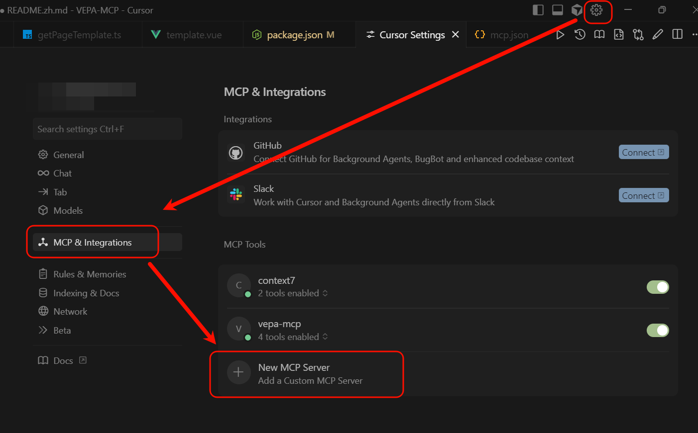

# VEPA-MCP

English | [中文](./README.zh.md)

<strike> A MCP server designed for projects based on vue-element-plus-admin, integrating component documentation, project specifications, and template files into the AI's context. </strike>

VEPA-MCP has now become a general-purpose MCP server suitable for a wide range of projects. An LLM can use this MCP to fetch the latest documentation for specified open-source projects and read specification and template files from designated directories. It currently provides four tools:

- resolve-library-id: Retrieve the Context7 ID.
- get-library-docs: Fetch the project documentation you want via a Context7 ID.
- get-project-specification: Get specification documents from a specified directory.
- get-page-template: Get page template files from a specified directory.

The capability to obtain the latest documentation comes from the [Context7 project](https://github.com/upstash/context7), which can search the latest documentation of common open-source projects. Since it applies RAG to project documentation, it supports relatively fuzzy searches and can retrieve multiple highly relevant document snippets. We can insert these snippets into the LLM’s context to reduce hallucinations.

## Installation

### Environment

- Node.js >= v18.0.0
- Cursor, Claude Code, VSCode, Windsurf, or another MCP client
- Context7 API key — optional, but recommended to increase request throughput. ([Get a Context API Key](https://context7.com/dashboard))

This project is published as an npm package: https://www.npmjs.com/package/@silkide/vepa-mcp, so you can invoke the service with `npx`. The example below shows how to add the MCP server in Cursor.

Open Cursor’s MCP server settings: `Settings` -> `Cursor Settings` -> `MCP` -> `Add new global MCP server`



In this view, open the MCP JSON configuration file and paste the following snippet:

```
json{
  "mcpServers": {
    // ....
    "vepa-mcp": {
      "command": "npx",
      "args": [
        "-y",
        "@silkide/vepa-mcp@latest"
      ]
    }
  }
}
```

Other MCP-enabled platforms are similar; refer to their respective documentation for platform-specific steps.

### Environment Variables and Startup Parameters

`vepa-mcp` provides several environment variables and CLI flags for customization:

- `CONTEXT7_KEY`: Set your Context7 API key. Alternatively, configure via the startup flag `--key xxx`.
- `CONTEXT7_TOKEN`: Controls the default number of tokens returned by Context7. Alternatively, configure via `--token xxx` (may not always take effect; tools invoked by the LLM can provide their own token limits).
- `SPEC_DIR`: Path to the project specification document. Defaults to `project/contexts/spec.md`. Alternatively, configure via `--spec-dir xxx`.
- `PAGE_TEMP_DIR`: Path to the page templates directory. Defaults to `project/contexts/template`. Alternatively, configure via `--page-temp-dir xxx`.

You can set startup parameters and environment variables in Cursor’s MCP configuration file:

```json
{
  "mcpServers": {
    // ....
    "vepa-mcp": {
      "command": "npx",
      "args": [
          "-y",
          "@silkide/vepa-mcp@latest",
          "--key xxx",
          "--spec-dir /xxx/xxx"
      ],
        "env": {
          "KEY": "value"
      }
    }
  }
}
```

## Specification Document

When the LLM invokes this MCP, it will first call the `get-project-specification` tool to review the project’s specification document. In the specification, it’s recommended to specify the primary dependencies and frameworks used in this project, and to look up the corresponding document IDs in advance on [context7.com](https://context7.com/), including those IDs in the specification.

You can also indicate in the specification the next steps the LLM should take after reading the specification, giving it stronger instruction adherence.You can view the example document in the project at ./test/contexts/spec.md.

## Development

Clone this project and install dependencies:

```shell
pnpm install
```

Build the project:

```shell
pnpm build
```

The final output is at `dist/index.js`. You can run this script:

```shell
node dist/index.js
```

We recommend using the VS Code MCP debugging extension developed by Kirigaya: [OpenMCP](https://openmcp.kirigaya.cn/), which makes debugging MCP services very convenient.

You can also use the official [inspector](https://github.com/modelcontextprotocol/inspector) for debugging.
